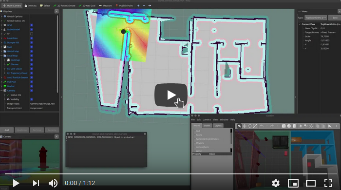

## Robotics Software Engineer Nanodegree Program

## Final Project: Home Service Robot

[](https://youtu.be/L2L7snV4sCs)

[//]: # (Image References)

[image1]: ./documentation/gazebo.png "Gazebo"
[image2]: ./documentation/frames.png "TF Frames"
[image3]: ./documentation/rosgraph.png "Graph"
[image4]: ./documentation/mapping.png "Mapping"
[image5]: ./documentation/navigation.png "Navigation"
[image6]: ./documentation/pickup_marker.png "Pick-up marker"
[image7]: ./documentation/dropoff_marker.png "Drop-off marker"

### Dependencies:
The project is based on the Turtlebot 2 that is only partially supported in ROS Melodic.
The following packages were added to the additional_resources folder that couldn't be install with apt-get.
* kobuki_bumper2pc
* kobuki_description
* kobuki_gazebo
* kobuki_gazebo_plugins
* kobuki_safety_controller
* turtlebot_apps packages

### Project build instrctions:
1. Clone this repo inside the `src` folder of a catkin workspace with the necessary submodules:
`git clone https://github.com/dudasdavid/Udacity-Robotics-Navigation`
2. Build workspace: `catkin_make` and install any missing packages.
3. Source environment: `source devel/setup.bash` 
4. Navigate to the folder of bash scrips: `cd src/Udacity-Robotics-Navigation/scripts`
5. Launch the home service bash file: `./home_service.sh`

### Summary of Tasks:
This repository implements waypoint navigation of Turtlebot 2 in a simulated Gazebo environment. The robot navigates to the pick up zone and then to the drop off zone. At the same time a visual marker will appear in RViz, first in the pick up location and later in the drop off location.

The Gazebo environment is based on the previous project, but further features were added to to the world file to help mapping:

`https://github.com/dudasdavid/Udacity-Robotics-SLAM`

#### Mapping
First, the map of the environment has to be done with Gmapping SLAM package using teleoperation.
Mapping can be started with `test_slam.sh`.
![alt text][image4]

After successful mapping, the map can be saved with the following command:

`rosrun map_server map_saver -f map`

#### Navigation
When the map is available, the navigation stack with `move_base` can be tested with the following bash script:

`test_navigation.sh`

There are many doors in the environment and the default parameters of the `turtlebot_navigation` package cannot generate a valid path so parameters were changed to optimize it to the environment. Global planner was changed, too. Project is using the `global_planner/GlobalPlanner` instead of `navfn/NavfnROS`.


#### Pick objects
The `pick_objects` package sends a goal position (pick-up location) to the navigation stack and it monitors the robot's position. When the robot reaches the target goal, it waits 5 seconds and it publishes a new goal (drop-off location) to the navigation stack.

The package can be tested with the following bash script:

`pick_objects.sh`

#### Add markers
The `add_markers` package displays a marker (blue cube) in the pick-up and drop-off locations.

The package can be tested with the following bash script:

`add_markers.sh`

#### Home service robot

The final project integrates the above packages and functionalities. At the beginning it displays a marker at the pick-up location then sends the navigation goal. The robot locates itself using AMCL on the saved map.

![alt text][image6]

The robot navigates to the pick-up location using the move_base ROS package.

![alt text][image5]

After it reaches the pick-up location target the marker disappears and the robot navigates to the drop-off location. Once it reaches the goal the marker appears at the drop-off location.

![alt text][image7]

The final project's graph:
![alt text][image3]

### Project structure:
```bash
tree -L 2
.Udacity-Robotics-Navigation        # Home Service Robot Project
├── additional_resources            # Additional packages that are not supported in ROS Melodic
│   ├── kobuki_bumper2pc
│   ├── kobuki_description
│   ├── kobuki_gazebo
│   ├── kobuki_gazebo_plugins
│   ├── kobuki_safety_controller
│   └── turtlebot_apps
├── add_markers                     # add_markers package
│   ├── CMakeLists.txt
│   ├── package.xml
│   └── src
├── README.md                       # Documentation
├── documentation
│   ├── dropoff_marker.png
│   ├── frames.png
│   ├── gazebo.png
│   ├── mapping.png
│   ├── navguide.pdf
│   ├── navigation.png
│   ├── pickup_marker.png
│   ├── rosgraph.png
│   └── video.png
├── map                             # Saved map
│   ├── map.pgm
│   └── map.yaml
├── pick_objects                    # pick_objects package
│   ├── CMakeLists.txt
│   ├── package.xml
│   └── src
├── rvizConfig                      # RViz config files
│   └── home_service_robot.rviz
├── scripts                         # Bash scripts
│   ├── add_markers.sh
│   ├── home_service.sh
│   ├── launch.sh
│   ├── pick_objects.sh
│   ├── test_navigation.sh
│   └── test_slam.sh
├── slam_gmapping                   # Gmapping source
│   ├── gmapping
│   └── slam_gmapping
├── turtlebot                       # Turtlebot source
│   ├── LICENSE
│   ├── README.md
│   ├── setup_create.sh
│   ├── setup_kobuki.sh
│   ├── turtlebot
│   ├── turtlebot_bringup
│   ├── turtlebot_capabilities
│   ├── turtlebot_capabilities.rosinstall
│   ├── turtlebot_description
│   ├── turtlebot.rosinstall
│   └── turtlebot_teleop
├── turtlebot_interactions          # Turtlebot source
│   ├── README.md
│   ├── turtlebot_dashboard
│   ├── turtlebot_interactions
│   ├── turtlebot_interactive_markers
│   └── turtlebot_rviz_launchers
├── turtlebot_simulator             # Turtlebot source
│   ├── README.md
│   ├── turtlebot_gazebo
│   ├── turtlebot_simulator
│   ├── turtlebot_simulator.rosinstall
│   ├── turtlebot_stage
│   └── turtlebot_stdr
└── worlds                          # Gazebo world files
    └── MyWorld.world
```

### Remarks:
* Project was built on Ubuntu 18.04 with ROS Melodic.
* Several packages were manually built because they are not available with apt-get in ROS Melodic, these packages are located in the additional_resources folder.
* Move_base's costmapparameters were tuned to be able to plan path through doors.

